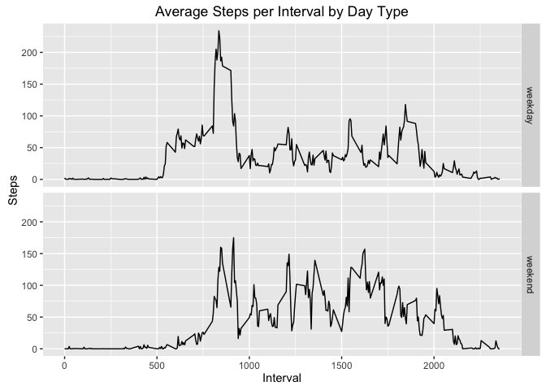

# Reproducible Research: Peer Assessment 1


## Loading and preprocessing the data

```r
activity <- read.csv('activity.csv', colClasses=c("integer", "Date", "integer"))
```

## What is mean total number of steps taken per day?

```r
sums <- c(aggregate(ts(activity$steps, freq = 288), 1, sum, na.rm = TRUE))
dates <- c(unique(activity$date))
days <- data.frame(dates, sums)
hist(days$sums, freq=TRUE, xlab="Number of Steps", main="Total Number of Steps per Day")
```


```r
mean(days$sums)
```

```
## [1] 9354.23
```

```r
median(days$sums)
```

```
## [1] 10395
```

## What is the average daily activity pattern?

```r
intervalAverages <- aggregate.data.frame(activity$steps, list(activity$interval), mean, na.rm=TRUE)
plot(intervalAverages[,1], intervalAverages[,2], type = "l", main = "Interval Average Across All Days", xlab = "Interval", ylab = "Number of Steps")
```


```r
intervalAverages[which.max(intervalAverages[,2]),]
```

```
##     Group.1        x
## 104     835 206.1698
```

## Inputing missing values

```r
nas<-data.frame(which(is.na(activity)), activity[which(is.na(activity)),])
nrow(nas)
```

```
## [1] 2304
```

```r
newActivity <- activity
for (i in 1:length(newActivity[,1])) {
    if (is.na(newActivity[i,1])) {
        newActivity[i,1] <- intervalAverages[intervalAverages[,1] == newActivity[i,3], 2]
    }
}

sums <- c(aggregate(ts(newActivity$steps, freq = 288), 1, sum, na.rm = TRUE))
dates <- c(unique(newActivity$date))

days <- data.frame(dates, sums)
hist(days$sums, freq=TRUE, xlab="Number of Steps", main="Total Number of Steps per Day")
```


```r
mean(days$sums)
```

```
## [1] 10766.19
```

```r
median(days$sums)
```

```
## [1] 10766.19
```

## Are there differences in activity patterns between weekdays and weekends?

```r
finalActivity <- activity
dayType <- lapply(weekdays.Date(finalActivity$date), function(x) { if(x == "Saturday" || x == "Sunday") { return("weekend") } else { return("weekday") } })
dayType.f <- factor(dayType, levels = c("weekday", "weekend"))
finalActivity$dayType <- dayType.f

dayTypeIntervalAverages <- aggregate.data.frame(finalActivity$steps, list(finalActivity$interval, finalActivity$dayType), mean, na.rm=TRUE)

library(ggplot2)

qplot(data=dayTypeIntervalAverages, y=x, x=Group.1, facets = Group.2 ~ ., geom="line", main="Average Steps per Interval by Day Type", xlab = "Interval", ylab = "Steps")
```


